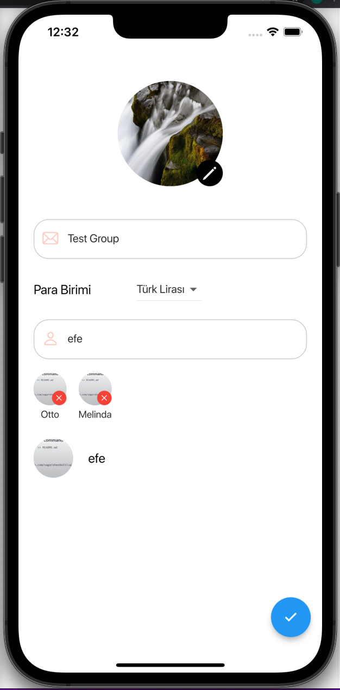

# PayPara

Ortak harcama yapan insanlar genel olarak yaptıkları harcamaların hesabını geleneksel yöntemlerle yaparlar ve bu durumda bir hesap karmaşası yaşanma durumu çok olasıdır ve neredeyse kaçınılmazdır. Özellikle aynı evde yaşayan ev arkadaşlar arasında bu durum daha sık görülebilir.  Bu sıkıntıları önüne geçebilmek için geliştirilecek mobil proje ile oluşturulan grup içerisindeki üyelerin yaptığı harcamalar kategorize bir şekilde kayıt altında tutularak, kişi bazında yapılan harcamaların da daha ayrıntılı bir şekilde takibini yapmaya olanak sağlayacaktır. Kısacası bu proje ortak harcama yapan her tür topluluğun; ev arkadaşları, iş arkadaşları, aile bireyleri vb.; harcama takibini kolay bir şekilde yapabileceği bir mobil uygulamadır.

## EKRANLAR
Uygulama içerisinde olacak ekranlardan bahsedecek olursak;

### Giriş ve Kayıt Ekranları
* Uygulamaya girişte bizleri giriş ve kayıt ekranları karşılıyor. Kayıt ekranından mail ve şifreleri ile kayıt olan kullanıcılar yine bu bilgilerle hesaplarına giriş yapabilirler. Ayrıca şifrelerini unutan kullanıcılar için yeni şifre alabilecekleri özel bir ekran da bulunmaktadır.
    

### Ana Sayfa
* Giriş yapan kullanıcıları karşılayacak olan ana sayfa da kullanıcının adı soyadı, net varlık bilgileri, bildirimleri görebileceği bildirim ikonu ve profil resminin bulunduğu bir alan, içerisinde bulunduğu grupların özet bir şekilde gösterildiği ikinci bir alan ve bu iki alanın alt kısmında yeni bir grup oluşturabileceği bir buton bulunmaktadır.

### Grup Detay Ekranı
* Ana sayfada bulunan gruplardan grup detayına gidildiğinde kullanıcıyı karşılayacak olan sayfa grup detay sayfasıdır. Bu sayfa içerisinde üst kısımda yine ana sayfada olduğu gibi grup bilgileri yer almaktadır. Bu bilgiler; grup profil fotoğrafı, grup ismi ve tarih seçim butonudur. Alt kısımda bulunan ikinci alanda; son bir aydaki grup üyelerinin kişi bazlı yaptıkları toplam harcamalar görülmektedir. Son olarak üçüncü alanda ise yapılan harcamaların kategori bazındaki toplamları bulunmaktadır.  Yine bu sayfada da ekleme yapabileceğimiz bir buton bulunmaktadır, bu butonun işlevi ise yapılan harcamaları kullanıcıların eklemesini sağlamaktır.

### Son Harcama Detay Ekranı
* Kullanıcılar grup detay sayfasındaki gösterilen harcamalara tıkladığında o gruba ait son harcamaların listeleneceği grup son harcama detay sayfasına yönlendirilecekleridir. Bu sayfada kullanıcıların yaptıkları harcamalar tarihleri ile birlikte kişi ve kategori bazlı listelenebilecektir.

### Grup Ayarlar Ekranı
* Grup ayarlar sayfasında oluşturulan grupların bilgileri tekrardan düzenlenebilecektir. Bu bilgiler grup profil fotoğrafı, grup ismidir. Ayrıca kullanıcı ekleme ve silme işlemleri de bu sayfadan yapılabilecektir.

### Profil Ekranı
* Profil sayfasında öncelikli olarak kullanıcının profil fotoğrafı ve ismi yer almaktadır. Yer aldığı gruplardaki yaptığı toplam harcama ve alacağı miktar bilgisinin yanı sıra net durum bilgisi de görüntülenebilecektir.

### Grup Oluşturma Ekranı
* Kullanıcıların uygulamayı birlikte kullanabilmeleri için bulunan sayfalardan bir diğeri de grup oluşturma sayfasıdır. Sayfada oluşturulacak olan grup için; grup profil fotoğrafı ekleme, grup adı oluşturma, kullanılacak para birimini seçme ve yeni kullanıcı ekleme özellikleri bulunmaktadır.

## İŞ YÖNETİMİ

Grup içerisinde yapılacak iş yönetimi trello üzerinden yönetilecektir.

## EKİP ŞEMASI

#
#

-----------------------------
## 09.12.2021 GÜNCELLEMELERİ
-----------------------------

## GRUP OLUŞTURMA EKRANI

### GRUP PROFİL FOTOĞRAFI SEÇME

### GRUP PROFİL FOTOĞRAF DÜZENLEME

### GRUP PARA BİRİMİ SEÇME

### GRUP İSMİ VE KİŞİ EKLEME

### VERİ TABANI 

